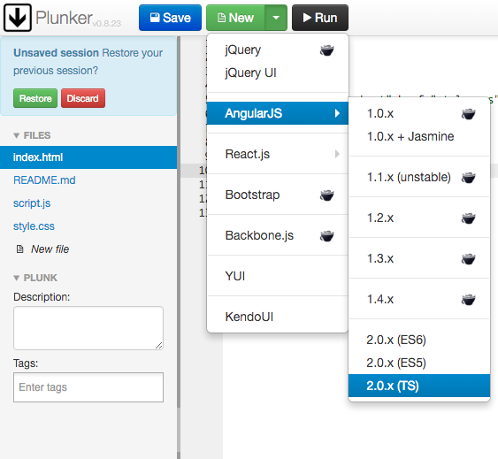

# a2-hackernews-reader

In this tutorial, our main objective is to learn the basic building blocks of Angular 2 by building a hackernews reader app.

What our end product looks like: https://plnkr.co/edit/ntu86TQogua6crAKkaN7?p=preview

- [Getting our online editor ready](#editor)
- [Hello Angular2](#hello-angular2)
- [Building hackernews reader step by step](#hackernews-reader)
    - [Create our base app frame](#base-frame)
    - [Display mock news list](#mock-data)
    - [Multiple components](#multiple-components)
    - [Retrieve actual hackernews data](#retrieve-data)
    - [Create pagination for our hackernews reader (Routing)](#routing)
- [That's all, where to go next](#go-next)

<a name="editor"></a>
## Getting our online editor ready
- For simplicity across different OSes, we'll be coding using an online editor, plunker. You guys can find plunker at http://plnkr.co/.
- Plunker transpile typescript in the browser on the fly, although it is not ideal for production applications, but it is good enough for us to explore and learn Angular2 today.


<a name="hello-angular2"></a>
## Hello Angular2
Load AngularJS 2.0.x (TS) from the drop down list beside New. (TS stands for TypeScript)
  
Now we have a working basic "Hello Angular2" app. Let's take a look at the files that are generated.
  - index.html
  - config.js
  - app.ts
  - main.ts

<a name="hackernews-reader"></a>
## Building hackernews reader step by step

<a name="base-frame"></a>
### Create our base app frame

Add bootstrap styling to `index.html`, we are using bootstrap to help us here, but any CSS framework can be used.
```html
<title>Hacker News Reader</title>
<link href="https://maxcdn.bootstrapcdn.com/bootstrap/3.3.6/css/bootstrap.min.css" rel="stylesheet" integrity="sha384-1q8mTJOASx8j1Au+a5WDVnPi2lkFfwwEAa8hDDdjZlpLegxhjVME1fgjWPGmkzs7" crossorigin="anonymous">
<link href="https://maxcdn.bootstrapcdn.com/font-awesome/4.5.0/css/font-awesome.min.css" rel="stylesheet" integrity="sha384-XdYbMnZ/QjLh6iI4ogqCTaIjrFk87ip+ekIjefZch0Y+PvJ8CDYtEs1ipDmPorQ+" crossorigin="anonymous">
<script src="https://code.jquery.com/jquery-2.2.2.min.js" integrity="sha256-36cp2Co+/62rEAAYHLmRCPIych47CvdM+uTBJwSzWjI=" crossorigin="anonymous"></script>
<script src="https://maxcdn.bootstrapcdn.com/bootstrap/3.3.6/js/bootstrap.min.js" integrity="sha384-0mSbJDEHialfmuBBQP6A4Qrprq5OVfW37PRR3j5ELqxss1yVqOtnepnHVP9aJ7xS" crossorigin="anonymous"></script>
```

Edit src/app.ts, change
```typescript
template: `
<div>
  <h2>Hello {{name}}</h2>

</div>
`,
```
to
```typescript
template: `
<h1>{{title}}</h1>
`,
```

and the class from
```typescript
export class App {
  constructor() {
    this.name = 'Angular2'
  }
}
```
to
```typescript
export class App {
  constructor() {}

  title = 'Hacker News';
}
```

The final file should look like this,
```typescript
//our root app component
import {Component} from 'angular2/core'

@Component({
  selector: 'my-app',
  providers: [],
  template: `
    <h1>{{title}}</h1>
  `,
  directives: []
})
export class App {
  constructor() {}

  title = 'Hacker News';
}
```

<a name="mock-data"></a>
### Display data in our app (mock data)
Lets add some mock data into our app.
```typescript
export class App {
  constructor() {}

  title = 'Hacker News';
  newsList = [
    {"title": "Recreating Daft Punk's Da Funk with Overtone and Leipzig",
    "url": "http://overtone-recipes.github.io/remake/2016/04/03/recreating-da-funk.html"},
    {"title": "Vis: A Vim Like Text Editor",
    "url": "https://github.com/martanne/vis"},
    {"title": "MathML is a failed web standard",
    "url": "https://www.peterkrautzberger.org/0186/"},
    {"title": "The Sugar Conspiracy",
    "url": "http://www.theguardian.com/society/2016/apr/07/the-sugar-conspiracy-robert-lustig-john-yudkin"},
    {"title": "The Silicon Valley of Transylvania",
    "url": "http://techcrunch.com/2016/04/06/the-silicon-valley-of-transylvania/"}
  ];
}
```

And show it in the template.
```typescript
template: `
<h1 class="title">{{title}}</h1>
<ul class="list-group">
  <li *ngFor="#newsItem of newsList; #i = index" class="list-group-item">
    {{i+1}}. <a href="{{ newsItem.url }}" target="_blank"> {{ newsItem.title }}</a>
  </li>
</ul>
`,
```

Since we already added bootstrap styling in, lets style our title as well
```typescript
styles:[`
    .title {
      color: white;
      background-color: #ff6600;
      margin-top: 0;
      margin-bottom: 20px;
      padding-top: 10px;
      padding-bottom: 10px;
      text-align: center;
    }
`]
```

By the end of this section, our code looks like
```typescript
//our root app component
import {Component} from 'angular2/core'

@Component({
  selector: 'my-app',
  providers: [],
  template: `
    <h1 class="title">{{title}}</h1>
    <ul class="list-group">
      <li *ngFor="#newsItem of newsList; #i = index" class="list-group-item">
        {{i+1}}. <a href="{{ newsItem.url }}" target="_blank"> {{ newsItem.title }}</a>
      </li>
    </ul>
  `,
  styles:[`
    .title {
      color: white;
      background-color: #ff6600;
      margin-top: 0;
      margin-bottom: 20px;
      padding-top: 10px;
      padding-bottom: 10px;
      text-align: center;
    }
  `],
  directives: []
})
export class App {
  constructor() {}

  title = 'Hacker News';
  newsList = [
    {"title": "Recreating Daft Punk's Da Funk with Overtone and Leipzig",
    "url": "http://overtone-recipes.github.io/remake/2016/04/03/recreating-da-funk.html"},
    {"title": "Vis: A Vim Like Text Editor",
    "url": "https://github.com/martanne/vis"},
    {"title": "MathML is a failed web standard",
    "url": "https://www.peterkrautzberger.org/0186/"},
    {"title": "The Sugar Conspiracy",
    "url": "http://www.theguardian.com/society/2016/apr/07/the-sugar-conspiracy-robert-lustig-john-yudkin"},
    {"title": "The Silicon Valley of Transylvania",
    "url": "http://techcrunch.com/2016/04/06/the-silicon-valley-of-transylvania/"}
  ];
}
```

<a name="multiple-components"></a>
## Multiple components
Lets try split our components in to multiple components and see how multiple components work together with each other.

Create these 3 new files, `src/news-list.component.ts`, `src/news-list.component.html`, `src/news-item.component.ts`  

src/news-list.component.ts
```typescript
import {Component} from 'angular2/core';

import {NewsItemComponent} from './news-item.component';

@Component({
  selector: 'hacker-news-list',
  templateUrl: 'src/news-list.component.html',
  directives: [NewsItemComponent]
})
export class NewsListComponent {
  constructor () {}
  
  newsList = [
    {"title": "Recreating Daft Punk's Da Funk with Overtone and Leipzig",
    "url": "http://overtone-recipes.github.io/remake/2016/04/03/recreating-da-funk.html"},
    {"title": "Vis: A Vim Like Text Editor",
    "url": "https://github.com/martanne/vis"},
    {"title": "MathML is a failed web standard",
    "url": "https://www.peterkrautzberger.org/0186/"},
    {"title": "The Sugar Conspiracy",
    "url": "http://www.theguardian.com/society/2016/apr/07/the-sugar-conspiracy-robert-lustig-john-yudkin"},
    {"title": "The Silicon Valley of Transylvania",
    "url": "http://techcrunch.com/2016/04/06/the-silicon-valley-of-transylvania/"}
  ];
}
```

src/news-list.component.html
```html
<div class="container">
  <ul class="list-group">
    <li *ngFor="#newsItem of newsList; #i = index" class="list-group-item">
      {{i+1}}. <news-item [newsItem]="newsItem"></news-item>
    </li>
  </ul>
</div>
```

src/news-item.component.ts
```typescript
import {Component, Input} from 'angular2/core';

@Component({
  selector: 'news-item',
  template: `<a href="{{ newsItem.url }}" target="_blank"> {{ newsItem.title }}</a>`
})
export class NewsItemComponent {
  constructor () {}
  
  @Input() newsItem;
}
```

Update src/app.ts
```typescript
//our root app component
import {Component} from 'angular2/core'

import {NewsListComponent} from './news-list.component';

@Component({
  selector: 'my-app',
  providers: [],
  template: `
    <h1 class="title">{{title}}</h1>
    <hacker-news-list></hacker-news-list>
  `,
  styles:[`
    .title {
      color: white;
      background-color: #ff6600;
      margin-top: 0;
      margin-bottom: 20px;
      padding-top: 10px;
      padding-bottom: 10px;
      text-align: center;
    }
  `],
  directives: [NewsListComponent]
})
export class App {
  constructor() {}

  title = 'Hacker News';
}
```

<a name="retrieve-data"></a>
## Retrieve actual hackernews data
Retrieve from actual server, need to use http ajax

add to `src\main.ts`, a requirement to use angular2's http library
```typescript
// Add all operators to Observable
import 'rxjs/Rx';
```

Then we are going to create a service for it  

Create `src/news-list.service.ts`
```typescript
import {Injectable}     from 'angular2/core';
import {Http, Response} from 'angular2/http';
import {Observable}     from 'rxjs/Observable';

@Injectable()
export class NewsListService {
  constructor (private _http: Http) {}

  getNewsList (page = 1) {
    const STORIES_PER_PAGE = 30;
    let sliceBegin = (page - 1) * STORIES_PER_PAGE;
    let sliceEnd = (page * STORIES_PER_PAGE);

    return this._http.get('https://hacker-news.firebaseio.com/v0/topstories.json')
                     .toPromise()
                     .then(res => {
                       // slice retrieved story ids into smaller chunks
                       return res.json().slice(sliceBegin, sliceEnd);
                     })
                     .then(ids => {
                       // retrieve all the stories concurrently
                       let postPromises = [];
                       for (let id of ids) {
                         postPromises.push(
                           this._http.get('https://hacker-news.firebaseio.com/v0/item/'+ id +'.json')
                               .toPromise()
                         );
                       }
                       return Promise.all(postPromises);
                     })
                     .then(postDatas => {
                       // extract and return story datas
                       let processedPostData = [];
                       for (let data of postDatas) {
                         processedPostData.push(data.json());
                       }
                       return processedPostData;
                     })
                     .catch(this._handleError);
  }

  private _handleError (error) {
    // in a real world app, we may send the error to some remote logging infrastructure
    // instead of just logging it to the console
    return 'Server error';
  }
}
```

add 2 imports to `src\app.ts`  
```typescript
import {HTTP_PROVIDERS} from 'angular2/http';
import {NewsListService} from './news-list.service';
```

and modify component decorator to
```typescript
@Component({
  selector: 'my-app',
  providers: [
    NewsListService,
    HTTP_PROVIDERS
  ],
  template: `
    <h1 class="title">{{title}}</h1>
    <hacker-news-list></hacker-news-list>
  `,
  styles:[`
    .title {
      color: white;
      background-color: #ff6600;
      margin-top: 0;
      margin-bottom: 20px;
      padding-top: 10px;
      padding-bottom: 10px;
      text-align: center;
    }
  `],
  directives: [NewsListComponent]
})
```

Update `src/news-list.component.ts`
```typescript
import {Component, OnInit} from 'angular2/core';

import {NewsListService} from './news-list.service';

import {NewsItemComponent} from './news-item.component';

@Component({
  selector: 'hacker-news-list',
  templateUrl: 'src/news-list.component.html',
  directives: [NewsItemComponent]
})
export class NewsListComponent implements OnInit {
  constructor (
    private _newsListService: NewsListService
  ) {}

  page;
  newsList;

  ngOnInit() {
    this.page = 1;
    this.getNewsList(this.page);
  }

  getNewsList(page = 1) {
    this._newsListService.getNewsList(page)
                         .then(
                           newsList => this.newsList = newsList,
                           error =>  this.errorMessage = <any>error
                          );
  }
}
```

<a name="routing"></a>
## Create pagination for our hackernews reader (Routing)
Add angular 2 routing library to our `index.html` (not all app requires routing, hence router library is an optional module library)
```html
<script src="https://code.angularjs.org/2.0.0-beta.8/router.dev.js"></script>
```

and at just below the `<head>` tag on top of `index.html`, add
```html
<head> <!-- Dont add this line -->
  <!-- Set the base href -->
  <script>document.write('<base href="' + document.location + '" />');</script>    
```

Update `src\app.ts` to
```typescript
import {Component} from 'angular2/core';
import {HTTP_PROVIDERS} from 'angular2/http';
import {RouteConfig, ROUTER_DIRECTIVES, ROUTER_PROVIDERS} from 'angular2/router';

import {NewsListService} from './news-list.service';

import {NewsListComponent} from './news-list.component';

@Component({
    selector: 'my-app',
    template: `
      <h1 class="title">Hacker News</h1>
      <router-outlet></router-outlet>
    `,
    styles:[`
      .title {
        color: white;
        background-color: #ff6600;
        margin-top: 0;
        margin-bottom: 20px;
        padding-top: 10px;
        padding-bottom: 10px;
        text-align: center;
      }
    `],
    directives: [ROUTER_DIRECTIVES],
    providers: [
      NewsListService,
      HTTP_PROVIDERS,
      ROUTER_PROVIDERS
    ]
})
@RouteConfig([
  {
    path: '/news-list',
    name: 'NewsList',
    component: NewsListComponent,
    useAsDefault: true
  },
  {
    path: '/news-list/:page',
    name: 'NewsListPage',
    component: NewsListComponent
  }
])
export class App { }
```

Update `src/news-list.component.ts`
```typescript
import {Component, OnInit} from 'angular2/core';
import {RouteParams, ROUTER_DIRECTIVES} from 'angular2/router';

import {NewsListService} from './news-list.service';

import {NewsItemComponent} from './news-item.component';

@Component({
  selector: 'hacker-news-list',
  templateUrl: 'src/news-list.component.html',
  directives: [NewsItemComponent, ROUTER_DIRECTIVES]
})
export class NewsListComponent implements OnInit {
  constructor (
    private _newsListService: NewsListService,
    private _routeParams: RouteParams
  ) {}

  page;
  newsList;

  ngOnInit() {
    // get the page parameter and default to page 1 if not specified
    this.page = +this._routeParams.get('page'); // + to cast the page param to number
    this.page = (this.page == 0) ? this.page + 1 : this.page;
    
    this.getNewsList(this.page);
  }

  getNewsList(page = 1) {
    this._newsListService.getNewsList(page)
                         .then(
                           newsList => {
                             console.log(newsList);
                             this.newsList = newsList;
                             },
                           error =>  this.errorMessage = <any>error
                          );
  }
}
```

In `src/news-list.component.html`, change `{{i+1}}` to `{{ (30* (page-1)) + i + 1 }}`

and add in a bootstrap pager to navigate between pages
```html
<nav>
  <ul class="pager">
    <li [ngClass]="{disabled: page == 1}" class="previous"><a [routerLink]="['NewsListPage', {page: page - 1}]"><span aria-hidden="true">&larr;</span> Older</a></li>
    <li class="next"><a [routerLink]="['NewsListPage', {page: page + 1}]">Newer <span aria-hidden="true">&rarr;</span></a></li>
  </ul>
</nav>
```

<a name="go-next"></a>
## That's all, where to go next
- For further learning typescript, check out http://www.typescriptlang.org/docs/tutorial.html
- For indepth Angular 2 learning, check out Angular 2 official website, https://angular.io/docs/ts/latest/
- In case Angular2's syntax are too much to memorize, can always refer to Angular 2's syntax cheat sheet, https://angular.io/docs/ts/latest/cheatsheet.html
- For those want to setup the development environment locally, check out official Angular guide at https://angular.io/docs/ts/latest/quickstart.html#!#devenv
